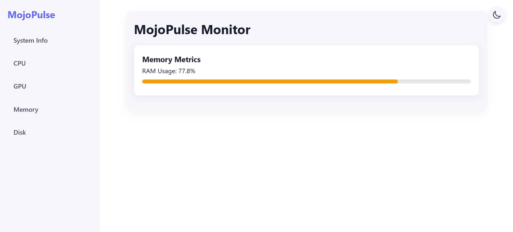

# MojoPulse

**Real-time system monitoring.**  
MojoPulse is a lightweight Flask-based web app that tracks CPU, GPU, memory, disk, and network stats in a sleek, responsive UI.

## Features

- Live CPU, GPU, memory, disk, and network metrics.
- Dark mode toggle.
- Cross-platform (Windows, Linux, macOS).
- Alerts for high usage (90%+).

## Installation

1. Clone:  
   ```bash
   git clone https://github.com/MojoX-Inc/Mojo-Pulse.git
   cd mojopulse
   ```

2. Install:  
   ```bash
   pip install -r requirements.txt
   ```
   Requires: Flask, psutil, GPUtil (optional).

3. Run:  
   ```bash
   python app.py
   ```
   Visit `http://localhost:5000`.

## Usage

- `/` - System overview.
- `/cpu` - CPU stats.
- `/gpu` - GPU stats.
- `/memory` - RAM usage.
- `/disk` - Disk space.
- `/network` - Network activity.

## Tech Stack

- Backend: Flask (Python).
- Frontend: Jinja2, HTML/CSS, JavaScript.
- Monitoring: psutil, GPUtil.

## License

[MIT License](LICENSE).

## Credits

Built by [Muhammad Noraeii](https://github.com/Muhammad-Noraeii).

---

## ScreenShots



